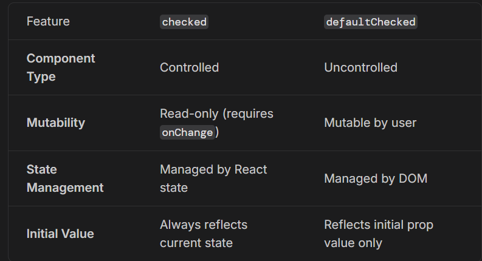

to get the number of state variable we have to see what all things are changing
  


```
import {createRoot} from 'react-dom/client';
import { useState } from 'react';

function Main(){
    const [pass,setpass]=useState("");
    const [length,setlength]=useState(0);
    const [number,setnumber]=useState(false);
    const [char,setchar]=useState(false);


    function generatePass(){
        let s="abcdefghijklmnopqrstuvwxyzABCDEFGHIJKLMNOPQRSTUVWXYZ";
        if(number){
            s+="1234567890";
        }
        if(char){
            s+="!@#$%^&*()_+><?:~`";
        }

        let passw="";

        for(let i=0;i<length;i++){
            passw+=s[Math.floor(Math.random()*(s.length))];
        }

        setpass(passw);
    };
    generatePass();
    return (
        <>
        <h1>{pass}</h1>
        <div>
            <input type="range" min="0" max="50" value={length} onChange={(e)=>{let val=e.target.value;setlength(val);generatePass();}}/>
            <span>Length({length})</span>

            <input type="checkbox" checked={number} onChange={()=>{setnumber(!number);generatePass();}}/>
            <label>Number</label>

            <input type="checkbox" checked={char} onChange={()=>{setchar(!char);generatePass();}}/>
            <label>Character</label>

            <button style={{marginLeft:"5px"}} onClick={() => {setlength(15);setnumber(false);setchar(false);}}>Reset</button>
        </div>
        </>
    );
}

createRoot(document.getElementById('root')).render(<Main/>);

```
  
here our function will go in infinite loop if we use generatepass like this|

  
# The Trap: React setState is Asynchronous 

When you call a state updater like setlength(5), React does not stop the code and update the variable right then and there.
  
Instead, React treats state updates like putting an order in at a restaurant.
  
You say setlength(5). (You hand the ticket to the kitchen).
  
React says, "Got it, I'll update that in a millisecond. Let me just finish running the rest of the code in this function first."
  
The very next line of code is generatePass(). JavaScript runs it immediately.
  
Because the kitchen hasn't finished preparing the new length yet, generatePass() is forced to use the old "stale" number sitting on the table.
  
## By moving generatePass() inside the useEffect, you are telling React: "Hey, take your time. Update the length, redraw the entire HTML DOM so the slider moves, make sure everything is 100% finished... and THEN run my password generator."

# "We don't use a major function inside an event listener, just use state functions there and use the major function in useEffect." 
  
## External Systems: Use useEffect to touch the DOM, fetch APIs, or set timers.
## Chain Reactions: Use useEffect when a change in one piece of State requires a complex, heavy recalculation of another piece of State (like generating a random password).